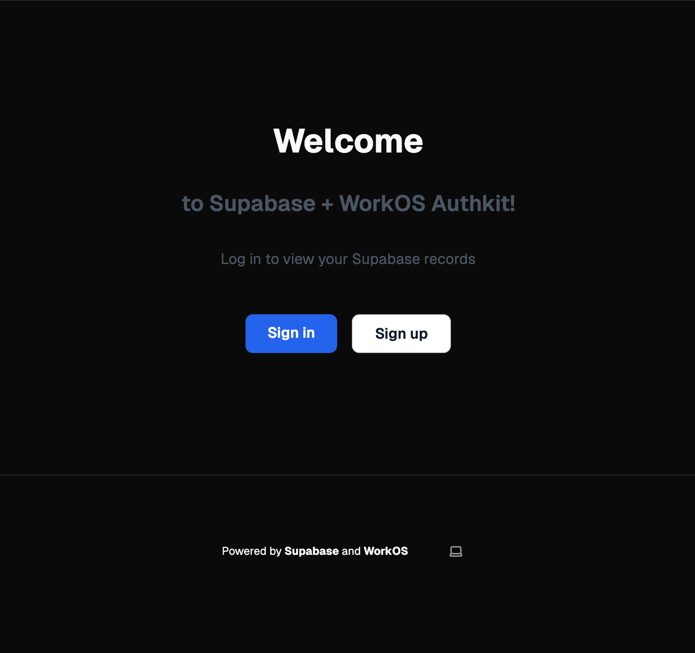
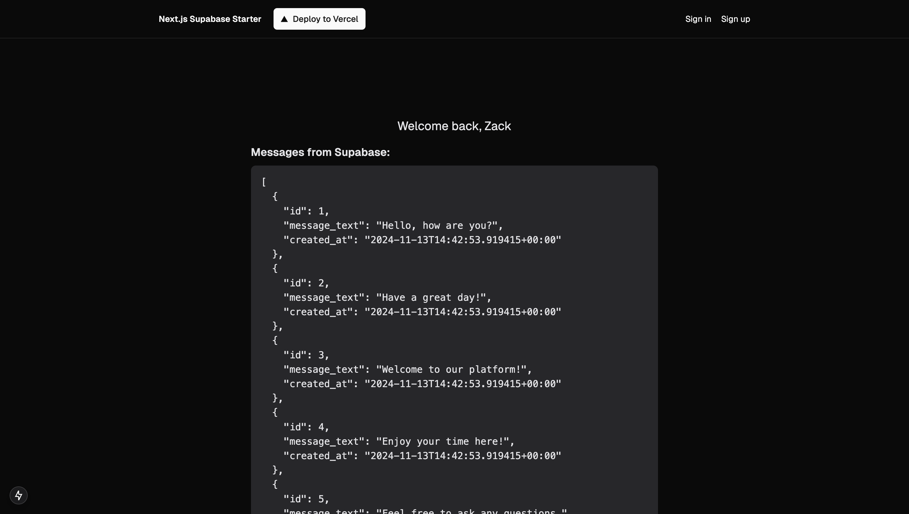
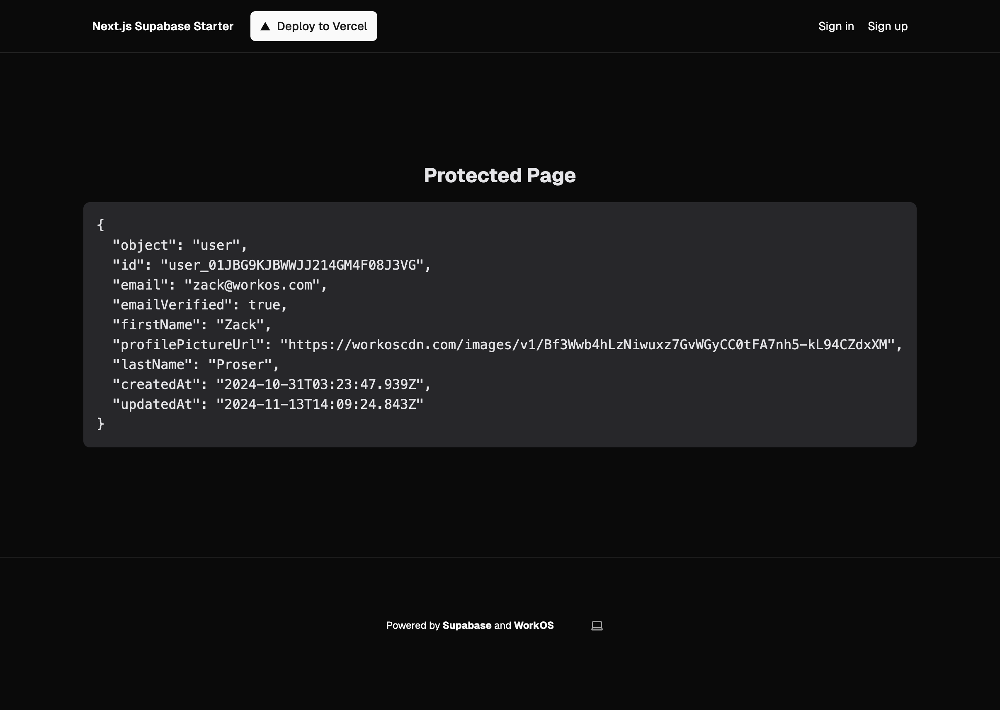

# Supabase and WorkOS AuthKit Next.js integration example

An example application demonstrating how to authenticate users with AuthKit and interact with Supabase data.



> Refer to the [User Management](https://workos.com/docs/user-management) and [Supabase](https://supabase.com/docs) documentation for reference.

## Prerequisites

- A [WorkOS account](https://dashboard.workos.com/signup)
- A [Supabase account](https://database.new)

## Requirements

Node v18 or higher

## Running the example

1. Rename `.env.example` to `.env` and configure the following environment variables, which you can retrieve from the [WorkOS dashboard](https://dashboard.workos.com/):

```sh
# WorkOS configuration
WORKOS_CLIENT_ID=client_... # retrieved from the WorkOS dashboard
WORKOS_API_KEY=sk_test_... # retrieved from the WorkOS dashboard
WORKOS_REDIRECT_URI=http://localhost:3000/callback # configured in the WorkOS dashboard
WORKOS_COOKIE_PASSWORD=<your password> # generate a secure password here

# Supabase configuration
NEXT_PUBLIC_SUPABASE_URL=[INSERT SUPABASE PROJECT URL]
NEXT_PUBLIC_SUPABASE_ANON_KEY=[INSERT SUPABASE PROJECT API ANON KEY]
```

`WORKOS_COOKIE_PASSWORD` must be at least 32 characters long. Generate one using [1Password](https://1password.com/password-generator/) or via command line:

```bash
openssl rand -base64 24
```

Both `NEXT_PUBLIC_SUPABASE_URL` and `NEXT_PUBLIC_SUPABASE_ANON_KEY` can be found in [your Supabase project's API settings](https://app.supabase.com/project/_/settings/api)

2. Install the dependencies:

```bash
npm install
```

3. Run the development server:

```bash
npm run dev
```

4. Navigate to [http://localhost:3000](http://localhost:3000)

## Features

- User authentication with WorkOS AuthKit
- Protected routes requiring authentication
- Supabase data access from authenticated routes
- Built with Next.js App Router
- Styling with Tailwind CSS

## Using the Sample App

### 1. Database Setup

After setting up your Supabase project, you'll need to create and populate a messages table. Run the following SQL in your [Supabase SQL Editor](https://app.supabase.com/project/_/sql):

```sql
CREATE TABLE messages (
    id BIGINT PRIMARY KEY GENERATED ALWAYS AS IDENTITY,
    message_text TEXT NOT NULL,
    created_at TIMESTAMP WITH TIME ZONE DEFAULT CURRENT_TIMESTAMP
);

INSERT INTO messages (message_text)
VALUES
    ('Hello, how are you?'),
    ('Have a great day!'),
    ('Welcome to our platform!'),
    ('Enjoy your time here!'),
    ('Feel free to ask any questions.'),
    ('We appreciate your feedback.'),
    ('Thank you for being a part of our community.'),
    ('Let us know how we can help you.'),
    ('Stay positive and keep smiling!'),
    ('Your support means a lot to us.'),
    ('Wishing you all the best!'),
    ('Keep up the great work!'),
    ('We are glad to have you with us.'),
    ('Take care and stay safe!'),
    ('Looking forward to your contributions!'),
    ('Every day is a new opportunity!');
```

### 2. Authentication Flow

1. Visit the homepage at `http://localhost:3000`
2. Click either "Sign up" to create a new account or "Sign in" if you already have one
3. Complete the authentication process through WorkOS AuthKit

### 3. Application Features

Once authenticated:

The homepage will display messages from your Supabase database



Visit `/protected` to view your user information. If you're not logged in, you'll be prompted to sign in

If you are logged in, you'll see your WorkOS user profile details

